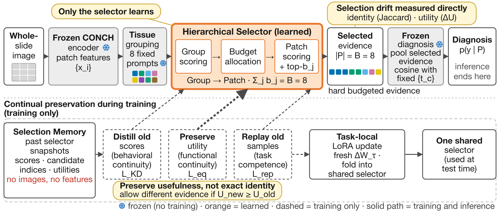

# PathSelect: Remembering Where to Look — Continual Hierarchical Evidence Selection for Whole-Slide Images

**Hsi-Ren Hung, [Second Author], Huei-Fang Yang** — Department of Computer Science and Engineering, National Sun Yat-sen University, Taiwan.
Manuscript under preparation for ICASSP 2027 (submission window closes 2026-09-16). This repository contains the code, experiment records, and manuscript sources; all numbers reported in the paper are machine-traced to committed result files (see *Provenance*).

---

## Overview

Whole-slide image (WSI) diagnosis operates under an evidence budget: a few patches are selected from thousands, and every downstream decision rests on them. When diagnostic tasks arrive sequentially, existing continual-learning methods protect classifiers or representations; the drift of the **evidence-selection policy** itself is not measured.

PathSelect isolates that policy as the object of continual learning. The CONCH image encoder, text encoder, and cosine diagnostic rule are frozen; the only trainable component is a hierarchical selector (group selector `F_g`, patch selector `F_p`). Between-method differences under a shared evaluation protocol are therefore attributable to selection behavior, and selection drift is measured directly (selection Jaccard, utility retention) in addition to accuracy, forgetting, and leakage.

<p align="center"></p>

**Three components**

1. *Prompt-guided hierarchical selection.* Patches are assigned to eight fixed tissue groups (tumor, stroma, lymphocyte, necrosis, normal epithelium, vessel, adipose, background) by cosine similarity to prompt embeddings; `F_g` allocates an integer budget across groups (largest-remainder), `F_p` selects the top patches within each group; a frozen head predicts from the selected set only (`|P| = B = 8`). The coarse-to-fine hierarchy follows HistoSelect (Huang et al., CVPR 2026) and is not claimed as a contribution.
2. *Exact incremental consolidation.* Each task trains low-rank LoRA adapters on `F_g` and `F_p`; at the task boundary the residual is folded into the shared weights (`W ← W + BA`), leaving one task-free selector at inference (no task ID, no memory access, no labels).
3. *Behavioral-snapshot preservation.* A Selection Memory (≤512 entries, reservoir sampling) stores group scores, patch scores, counterfactual utilities, and indices — never images or features. During later tasks these snapshots drive dual-level distillation (behavioral continuity), a utility-preservation hinge (functional continuity), and replay (task competence).

**Six supervision terms, each answering one question**

| Term | Question | Definition |
|---|---|---|
| `L_diag` | Did the selected evidence predict correctly? | cross-entropy of the frozen head on the selected set |
| `L_sem` | Is the patch diagnostically discriminative? | KL to a prior from the entropy of class-text similarities |
| `L_util` | Which candidate lowers the diagnostic loss? | KL to counterfactual gains `u_i = L(E) − L(E ∪ {x_i})` (closed form) |
| `L_KD` | Are old slides still scored the same way? | KL(r_old‖r_new) + KL(s_old‖s_new) against stored snapshots |
| `L_eq` | Is the new evidence at least as useful as before? | `max(0, U_old − U_new)`, `U = log C − CE` (regression only) |
| `L_replay` | Can old tasks still be solved? | `L_diag` on replayed slides |

---

## Main results

Four sequential TCGA organ tasks (ESCA → RCC → BRCA → LUNG; the four-organ sequence used in prior continual WSI work, traversed in reverse order), each a binary subtype task, final eight-class label space. Flat substrate, five seeds; between-arm comparisons are paired per seed and reported with win counts (5/5 = systematic, 4/5 = directional; no p-values by pre-registration).

| Method | class-IL ↑ | forgetting ↓ | plasticity ↑ | sel. Jaccard ↑ | task-IL ↑ | leakage ↓ |
|---|---|---|---|---|---|---|
| per-task specialist (R1) | 0.8777 | — | 0.8777 | — | 0.9027 | — |
| joint offline (R2) | 0.7789 | — | 0.7789 | — | 0.8498 | — |
| sequential fine-tuning (A1) | 0.4774 | 0.5193 | 0.8669 | 0.0023 | 0.8086 | 0.4408 |
| LoRA merge only (A2) | 0.4466 | 0.5798 | 0.8814 | 0.0010 | 0.8105 | 0.4756 |
| + replay (A3) | 0.7778 | 0.1102 | 0.8514 | 0.0864 | 0.9073 | 0.104 |
| + distillation (A4) | 0.7972 | 0.1063 | 0.8689 | **0.1752** | 0.8969 | 0.117 |
| **PathSelect (A5)** | **0.8239** | **0.0539** | 0.8515 | 0.1613 | **0.9147** | **0.1005** |

- PathSelect improves final class-IL accuracy over sequential fine-tuning by 34.6 points in every seed, halves forgetting relative to replay alone, and retains two orders of magnitude more of its originally selected evidence.
- LoRA merging alone shows no systematic difference from full-parameter sequential fine-tuning (3/5): merging is the deployment substrate, not the preservation mechanism.
- Selection identity and selection usefulness are different quantities: A4 has higher Jaccard than A5 but worse accuracy and forgetting.

**Component ablation** (flat): distillation alone leaves leakage at 0.323 (three times the full method); replay restores task attribution; no single term or pair matches the full set. **Update-protocol ablations** (warm start, single persistent adapter, post-hoc composition, damped merging, hierarchical substrate) and the refuted expectation on composition are reported in `docs/DR046_GATES.md`; every comparison was decided by a rule registered before the run.

---

## Repository layout

```
selector/      model, grouping, allocation, losses, memory, LoRA
scripts/       experiment drivers and report generators (see below)
tests/         unit, guard, and mutation tests (1,268 tests)
outputs/       committed per-slide records and regenerated summary tables
docs/          results dossier, gate tables, decision-record ledger, playbook
paper/         manuscript sources (main.tex, refs.bib, figures/, versions/)
configs/ data/ reference/ third_party/
```

## Reproducibility

```bash
# environment
# No dependency file is committed yet; the third-party imports under
# selector/, scripts/ and data/ are exactly these (verified by AST scan):
pip install torch numpy pandas scikit-learn matplotlib h5py PyYAML pytest
# CONCH inference code is vendored in third_party/conch (no pip install needed).

# data: pre-extracted CONCH patch features for the four TCGA tasks
# All paths live in configs/pathselect.yaml -- edit these keys before running:
#   dataset_root_dir : root of the pre-extracted feature tree
#   path_feat        : /{task}/feats-l1-s256_CONCH/pt_files   (one .pt per slide, [n, 512])
#   path_split       : /{task}/datasplit/fold_{fold}.npz      (train/test split; fold: 1)
#   path_table       : /{task}/table/{task}_path_subtype_x10_processed.csv  (labels)
#   conch_ckpt_path  : local CONCH CoCa checkpoint (pytorch_model.bin)
#   class_prompt_path: data/class_prompts.json  (committed)
# TCGA slides/features and the CONCH weights are NOT redistributed with this
# repository; obtain them from TCGA and from the CONCH authors respectively.

# run the main continual-learning experiment (arms x seeds x order x architecture)
python scripts/run_exp2.py --arms A2,A5 --arch hier --order reverse --seeds 0,1,2,3,4 --tag main

# regenerate summary tables and gate tables from committed per-slide records
python scripts/report_dr046.py
python scripts/report_dr046_gates.py

# trace every number in the manuscript to committed artifacts
python scripts/verify_doc_numbers.py

# tests
python -m pytest tests/ -q
```

## Provenance and governance

- **Pre-registration.** Every design decision and every comparison has a decision-record card in `docs/ledger/` with a two-sided rule fixed before the run; the gate outcomes (including one refuted expectation) are tabulated in `docs/DR046_GATES.md`.
- **Frozen milestones.** Git tags `dr046-phase0`, `dr046-phaseA`, `dr046-phaseB`, `dr046-freeze` mark the experimental milestones; results are append-only.
- **Number traceability.** `scripts/verify_doc_numbers.py` checks that each numeric value in `paper/main.tex` appears in a committed artifact, and mutation tests confirm the check fails when a number is altered.
- **Playbook.** `docs/playbook/` documents the research operating procedure used in this project.

## Related work acknowledged in the method

The hierarchical group→patch selection substrate follows HistoSelect (Huang et al., *Act Like a Pathologist*, CVPR 2026). Continual WSI learning precedents include ConSlide (ICCV 2023), MICIL (AIM 2024), QPMIL-VL (AAAI 2025), and attention distillation with pseudo-bag memory (Li et al., CVPR 2025); PathSelect differs by freezing the complete diagnostic pathway, selecting a hard budgeted set, preserving set utility in addition to score behavior, and measuring selection identity and utility directly.

## Citation

```bibtex
@inproceedings{hung2027pathselect,
  title     = {Remembering Where to Look: Continual Hierarchical Evidence Selection for Whole-Slide Images},
  author    = {Hung, Hsi-Ren and [Second Author] and Yang, Huei-Fang},
  booktitle = {ICASSP (under review)},
  year      = {2027}
}
```

## Acknowledgments

This work was supported in part by the National Science and Technology Council, Taiwan, under Grants NSTC 112-2221-E-110-047-MY3, 114-2640-E-110-004, and 114-2634-F-006-002.

## License

License: to be determined. No `LICENSE` file is committed yet.
